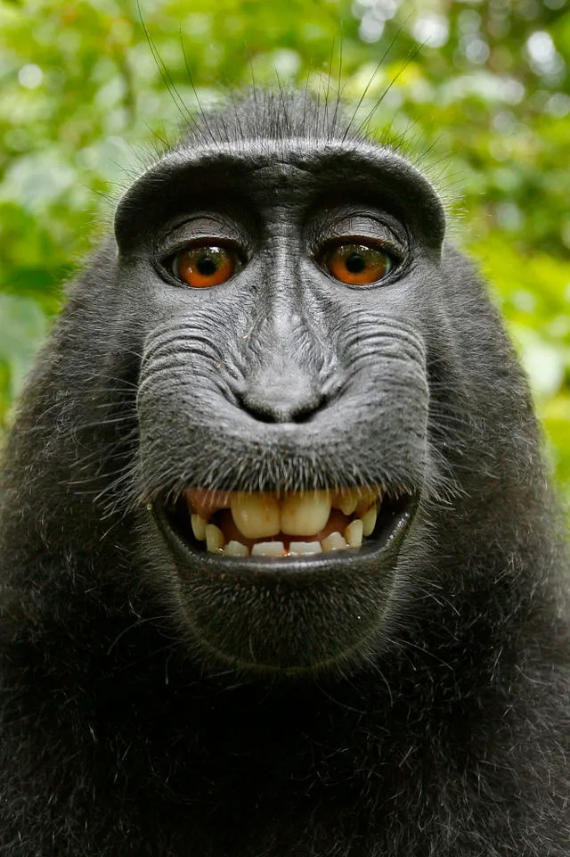
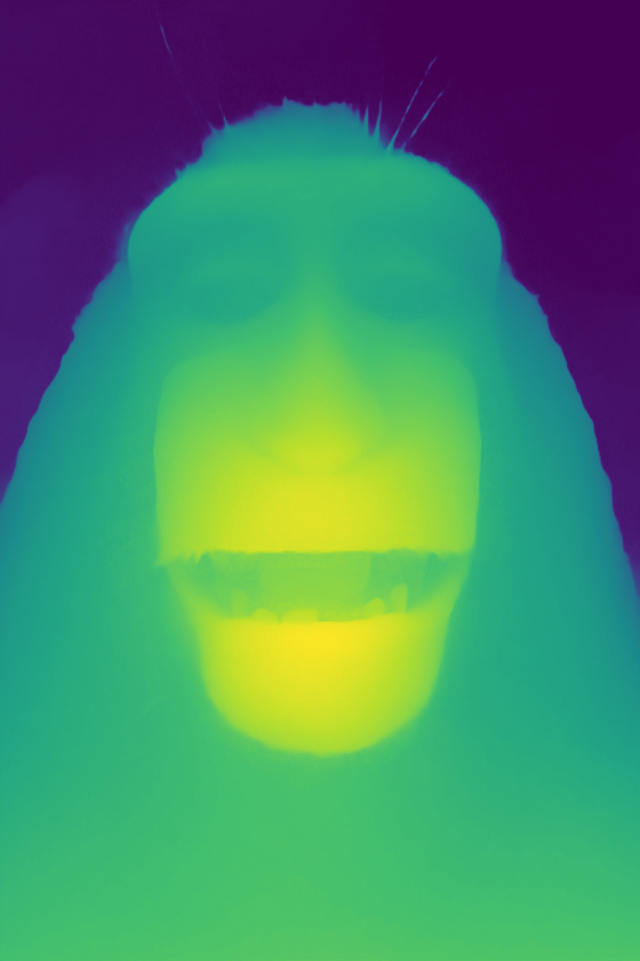

# Local CPU-Only Image-to-3D Relief Pipeline Tool

A local, CPU-only CLI tool that converts a single 2D image into a textured 3D mesh (`.obj`/`.glb`) via depth-relief geometry extraction. 

The pipeline performing this conversion is:
`Image → Monocular Depth Estimation → Depth Inpainting → Point Cloud Projection → Mesh Reconstruction → Mesh Export`

---

## Test Visualizations & Screenshots

Below are the visual comparisons of the input image, estimated depth map, point cloud projection, and the reconstructed 3D meshes.

### 1. Input Image vs. Depth Map Estimation & Inpainting
| Input Image (`photo.jpg`) | Raw Depth Map (Viridis) |
| :---: | :---: | :---: |
|  |  |


### 2. Point Cloud Projection
| Projected Point Cloud (`pointcloud.gif`) |
| :---: |
|  |

### 3. Mesh Reconstruction (Raw vs. Repaired)
| Raw Mesh (`raw.gif` with gap/hole) | Repaired Mesh (`filled.gif` closed) |
| :---: | :---: |
|  |  |

---

## Technical Architecture & How It Works

Here is a detailed breakdown of the mathematics and algorithms running under the hood at each stage of the pipeline.

```
+---------------+      +-------------------+      +----------------------+
|  Input Image  | ---> | Depth Anything V2 | ---> |  Outlier Inpainting  |
+---------------+      +---------+---------+      +----------+-----------+
                                 |                           |
                                 v                           v
+------------------+   +---------+---------+      +----------+-----------+
|  Output Mesh GLB | < | Mesh Post-Process | <--- | Poisson Octree Recon |
+------------------+   +-------------------+      +----------------------+
```

### Stage 1: Optimized Depth Estimation (ONNX vs. PyTorch)
We load the **Depth Anything V2** monocular depth model. 
*   **The Problem:** Vision Transformers (ViTs) flatten spatial patches. During ONNX tracing/export, the patch shape calculation gets hardcoded based on the dummy input's aspect ratio. Feeding non-square images into the exported ONNX model causes a runtime shape mismatch crash inside the network's `Reshape` layers.
*   **The Solution:** 
    1. During preprocessing, the input image of size $W \times H$ is cropped/resized to a fixed square of $518 \times 518$ pixels before model inference.
    2. ONNX Runtime performs fast CPU execution on the square input.
    3. The resulting depth map is resized back to the original aspect ratio ($W \times H$) using bilinear interpolation.
*   **Normalization:** Raw model outputs are relative values. We normalize them to $[0.0, 1.0]$ where $0.0$ is the farthest point and $1.0$ is the closest point:
    $$D_{\text{norm}} = \frac{D - D_{\text{min}}}{D_{\text{max}} - D_{\text{min}}}$$

### Stage 2: Statistical Outlier Inpainting
Dark colors, shadows, and low-contrast regions (e.g., hair, dark clothing) confuse monocular depth models, making them incorrectly estimate foreground pixels as far background depth (causing deep "pits" in the depth map).
*   **Outlier Detection:** We apply a $5 \times 5$ median blur filter to the depth map to estimate the local neighborhood's depth. We extract a mask of negative outliers (pits/valleys) where:
    $$\text{LocalMedian}(D) - D > \text{threshold}$$
    *Note: We only detect when the pixel is farther than its surrounding median. We do not use absolute differences, which preserves the sharp foreground borders.*
*   **Inpainting:** We apply OpenCV's Fast Marching Method (`cv2.inpaint` with Telea's algorithm) to smoothly interpolate and fill the outlier mask pixels using neighboring values.

### Stage 3: Pinhole Camera Back-projection
We convert the 2D pixel coordinates $(u, v)$ and their depth value $Z$ into 3D Cartesian coordinates $(X, Y, Z)$ using camera intrinsics.

#### A. Intrinsics Derivation
If focal lengths $f_x, f_y$ and principal points $c_x, c_y$ are not provided, they are derived from the image dimensions ($W, H$) and the camera's horizontal field of view ($\theta_{\text{fov}}$):
$$f_x = \frac{W}{2 \cdot \tan\left(\frac{\theta_{\text{fov}} \cdot \pi}{360}\right)}$$
$$f_y = f_x \quad (\text{assuming square pixels})$$
$$c_x = \frac{W}{2.0}, \quad c_y = \frac{H}{2.0}$$

#### B. Depth Mapping (Relative to Metric)
We map the normalized depth $D_{\text{norm}} \in [0, 1]$ to metric depth $Z \in [d_{\text{min}}, d_{\text{max}}]$ (where $d_{\text{min}}$ is the near plane and $d_{\text{max}}$ is the far plane, e.g., 0.5m to 2.0m):
*   **Inverse Mapping (Disparity-Based):** Preserves perspective since relative depth models output disparity-proportional values ($D \propto 1/Z$):
    $$Z = \frac{1.0}{D_{\text{norm}} \cdot \left(\frac{1}{d_{\text{min}}} - \frac{1}{d_{\text{max}}}\right) + \frac{1}{d_{\text{max}}}}$$
*   **Linear Mapping:**
    $$Z = d_{\text{max}} - D_{\text{norm}} \cdot (d_{\text{max}} - d_{\text{min}})$$

#### C. Back-projection Equations
We map each pixel $(u, v)$ to 3D. Since row index $v$ starts from $0$ at the top and goes down, we flip the Y coordinates so that positive Y represents "up" in 3D:
$$X = \frac{(u - c_x) \cdot Z}{f_x}$$
$$Y = -\frac{(v - c_y) \cdot Z}{f_y}$$
$$Z = Z$$

### Stage 4: Mesh Reconstruction
We estimate unit normal vectors for each point in the point cloud using a hybrid KD-Tree search (radius $0.1$m, max $30$ neighbors) and align them consistently to point towards the camera sensor at $[0.0, 0.0, 0.0]$.

#### A. Poisson Surface Reconstruction
We solve for an implicit indicator function whose gradient matches the aligned normals using an Octree (default depth $9$, representing $512^3$ voxels). The solver returns a triangle mesh along with per-vertex density values (confidence).

#### B. Hole-Aware Trimming
Poisson reconstruction is known for creating boundary blobs. Standard trimming removes all vertices below a confidence threshold (e.g., bottom 10% density), which can punch holes in low-density interior regions.
*   **Graph-based Neighborhood Check:** We build the vertex adjacency list. For any vertex flagged for density removal, we check its adjacent neighbors. If the proportion of its neighbors flagged for removal is less than $50\%$, we protect the vertex and do **not** remove it:
    $$\frac{|\{n \in \text{Neighbors}(i) \mid \text{Trimmable}[n] = \text{True}\}|}{|\text{Neighbors}(i)|} < 0.5 \implies \text{Keep Vertex } i$$
    This preserves the interior structure and prevents noise from carving holes.

#### C. Connected Component Cleanup (Island Removal)
Density trimming can produce tiny disconnected floating fragments. We run edge-based triangle clustering. We calculate the size of all clusters and discard all disconnected islands, keeping only the single largest connected mesh component.

#### D. Tensor-based Hole Filling
Any remaining open boundaries are sealed using Open3D's tensor-based `fill_holes` post-processing. The mesh is converted to a tensor representation, boundaries of radius $\le$ `max_hole_size` are triangulated, and the mesh is converted back to legacy format. Normals are recomputed to ensure smooth lighting.

---

## Installation & Virtual Environment Setup

This tool runs entirely on CPU (no GPU required) and is tested on Python 3.11+.

1. **Clone and navigate to the project directory:**
   ```bash
   git clone https://github.com/ivaaneoski/imageTo3D.git
   cd imageTo3D
   ```

2. **Initialize the virtual environment:**
   ```bash
   python -m venv venv
   ```

3. **Activate the virtual environment:**
   - **On PowerShell:**
     ```powershell
     .\venv\Scripts\Activate.ps1
     ```
   - **On Command Prompt (cmd):**
     ```cmd
     venv\Scripts\activate.bat
     ```
   - **On Linux / macOS:**
     ```bash
     source venv/bin/activate
     ```

4. **Install all dependencies (installs CPU-only PyTorch and headless OpenCV):**
   ```bash
   pip install -r requirements.txt
   ```

---

## CLI Usage & Executing the Pipeline

Once the virtual environment is activated, run the full pipeline using your test image:

### Run the full pipeline (saves raw, filled, and point cloud outputs):
```bash
python cli.py --input photo.jpg --output test_data/portrait.glb --model vits --method poisson --save-intermediates
```

### Options & Customization Flags:
*   `--model {vits, vitb}`: Model size for Depth Anything V2. Small (`vits`, default) or Base (`vitb`, higher RAM/CPU load but significantly more detailed depth maps).
*   `--method {poisson, ball_pivoting}`: Reconstruct method. Default: `poisson`.
*   `--decimate <int>`: Target number of triangles for mesh decimation (e.g. `--decimate 50000` to simplify the mesh).
*   `--inpaint-threshold <float>`: Sensitivity for negative outlier (pit) depth detection. Lower values fill more aggressively. Default: `0.1`.
*   `--max-hole-size <float>`: Maximum hole boundary radius to fill (in meters). Default: `0.1`.
*   `--save-intermediates`: Saves the intermediate depth maps and density ply files in the `intermediates/` directory.
*   `--skip-raw` / `--skip-filled` / `--skip-pointcloud`: Optional flags to skip saving specific output formats.

### Standalone Point-Cloud Exporter
For fast image-to-point-cloud generation without mesh reconstruction:
```bash
python pointcloud_only.py --input photo.jpg --output test_data/standalone_cloud.ply
```

---

## Recommended 3D Viewer Extensions (VS Code)

To inspect the point clouds and meshes directly inside VS Code, install the following extensions:
1.  **3D Point Cloud and Mesh Visualizer** by *kleinicke* (ideal for opening and inspecting `.ply` point cloud files).
2.  **Super GLB Viewer** by *JessyLeite* (ideal for viewing `.glb` 3D model meshes).

---

## Repository Directory Structure

```
image-to-3d/
├── src/
│   ├── __init__.py
│   ├── depth.py          # Depth Anything V2 loader, ONNX inference, inpainting & colorization
│   ├── pointcloud.py     # Pinhole camera vectorized depth projection to 3D point cloud
│   ├── mesh.py           # Normal orientation, Poisson & BPA mesh reconstruction, repair filters
│   ├── export.py         # OBJ & pygltflib-based GLB workaround mesh exporters
│   └── pipeline.py       # Orchestrator running raw & filled pipeline paths
├── cli.py                # Main CLI entrypoint
├── pointcloud_only.py    # Standalone point cloud script
├── requirements.txt      # Project dependencies (CPU-optimized)
└── README.md             # Developer documentation
```

---

## Known Limitations & Core Constraints
- **Relief Geometry Only (No Back-Side):** This tool does NOT perform "walk-around" full 3D object generation. It produces accurate depth and geometry for **what the camera saw only**. The back of the objects is open, and occluded geometry is not reconstructed.
- **Relative Depth, Not Metric:** The estimated depth is relative (disparity-based), not absolute. The dimensions of the output mesh do not correspond to physical real-world units (meters) unless you define reference distances.
- **Reflective & Textureless Surfaces:** Glass, mirrors, metallic objects, or completely featureless/flat surfaces will produce noisy or incorrect depth estimations.
